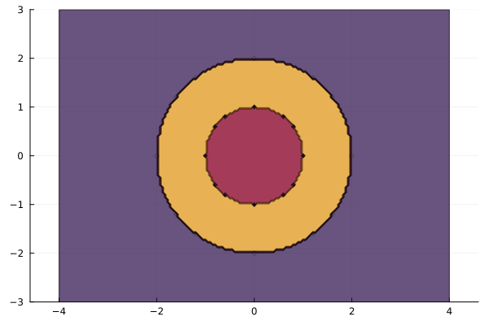

# HypersurfaceRegions.jl

We present a Julia package 
for computing the *regions* (i.e., connected components) in the complement of an arrangement of real
hypersurfaces.

Our input consists of
$k$ polynomials in $n$ variables.
The output is a list of all regions of the complement of the zero set of these polynomials.

For each region $C$ we report the Euler characteristic and well-chosen
sample points.
The list is grouped according to sign vectors $\sigma \in  \{-1,+1 \}^k$,
where $\sigma_i$ is the sign of the $i$th polynomial on $C$.
For hyperplane arrangements, each region is
uniquely characterized by its sign vector. However, in our situation, each sign vector $\sigma$ typically
corresponds to multiple connected components.

## Example: two concentric circles

Let us consider two concentric circles. For instance, we could take the two circles $f_1 = x^2 + y^2 - 1=0$ and $f_2=x^2 + y^2 - 4=0$ centered at the origin. To compute the regions of $\mathcal{U}  =   \{ u \in \mathbb{R}^2  \mid   f_1(u) \cdot f_2(u)  \not=  0 \}$ we can use the following code:    

```julia
julia> using HypersurfaceRegions
julia> @var x y;
julia> f_1 = x^2 + y^2 - 1;
julia> f_2 = x^2 + y^2 - 4;
julia> f = [f_1; f_2]
julia> C = regions(f)
egionsResult with 3 regions:
=============================
9 complex critical points
5 real critical points
╭──────────────┬───────────────────────╮
│ sign pattern │ regions               │
├──────────────┼───────────────────────┤
│ + +          │ number = 1            │
│              │  χ = 0, μ = [1, 1, 0] │
│ - -          │ number = 1            │
│              │  χ = 1, μ = [1, 0, 0] │
│ + -          │ number = 1            │
│              │  χ = 0, μ = [1, 1, 0] │
╰──────────────┴───────────────────────╯
```

The output shows that $\mathcal U$ has three regions. The first region has sign pattern $++$. This means that, on this region, both $f_1$ and $f_2$ are positive. On the second region, both $f_1$ and $f_2$ are negative, so it is the contractible region in the middle. The software correctly reports that this region has Euler characteristic 1. The other two regions each have one hole and thus have Euler characteristic 0. 

Let us visualize the three regions. We use the [Plots.jl](https://docs.juliaplots.org/) package. For this, we define a function that spits out a color corresponding to a region given a point. 

```julia
function region_col(x, y)
    Ci = membership(C, [x; y]; warning = false)
    if !isnothing(Ci)
        return number(Ci)
    else
        return nothing
    end
end 

u = -4:0.05:4; v = -3:0.05:3;
X = repeat(reshape(u, 1, :), length(v), 1);
Y = repeat(v, 1, length(u));
Z = map(region_col, X, Y);

using Plots
contour(u, v, Z, fill = true, alpha = 0.25, 
                                    legend = false, 
                                    aspect_ratio = :equal)
```

This produces the following picture:



## Example: 3 random polynomials

We can set up a random example as follows.
```julia
using HypersurfaceRegions
@var v[1:3];
f = [rand_poly(Float64, v, d) for d in [2, 3, 3]];
C = regions(f)
```

Here, `f` consists of 3 random polynomials in `v`. The degrees of these polynomials are `[2, 3, 3]`. The coefficients are chosen from a Gaussian distribution. 

At a certain number of rows, the output of `C` in terminal is cropped. To avoid this, we can use the following command.
```julia
show(C; crop = false)
```


## Documentation: Output

```@docs
RegionsResult
Region
```

## Documentation: Main functions

```@docs
regions
projective_regions
```


## Documentation: Helper functions

Functions to call on [RegionsResult](@ref).
```@docs
regions
nregions
nbounded
nunbounded
nundecided
bounded
unbounded
undecided
euler_characteristics
index_vectors
ncritical_complex
ncritical_real
g
variables
```

Functions to call on [Region](@ref).
```@docs
χ
μ
critical_points
is_bounded
is_unbounded
is_undecided
```